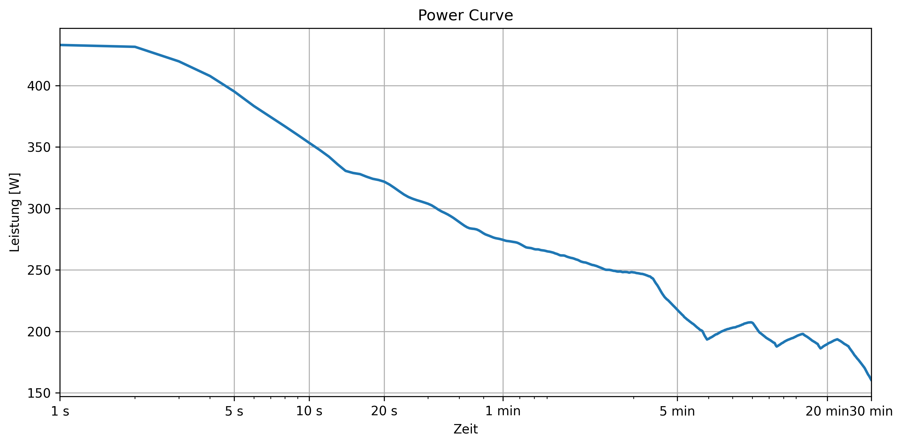

# Aufgabe-Leistungskurve II

**Teilnehmerinnen:** Melanie Pfusterer, Lisa Raffler, Vanessa Reich

Das Projekt erstellt aus Leistungsdaten in Watt eine **Power Curve**. Die Leistungswerte werden aus einer Datei (*activity.csv*) geladen, verarbeitet und anschließend als Leistungskurve dargestellt.

Zur Installation des Projekts wird pip verwendet.

## Um die Power curve anzeigen zu lassen, muss folgendermaßen vorgegangen werden:

1. Erstellen einer virtuellen Umgebung
   **->** python -m venv .venv

2. Aktivierung der virtuellen Umgebung
   **->** .venv\Scripts\activate

3. Installation der Abhängigkeiten
   **->** pip install -r requirements.txt

4. Projekt starten
   **->** python main.py

## Was macht das Projekt?

1. Leistungsdaten werden aus einer Datei (*activity.csv*) geladen und aussortiert.
2. Für verschiedene Zeitdauern wird die maximale durchschnittliche Leistung berechnet.
3. Die Ergebnisse werden in einem DataFrame gespeichert.
4. Die Power Curve wird als Diagramm dargestellt.
5. Die Grafik wird gespeichert.

## Projektstruktur

* **main.py**
  Hauptskript zum Ausführen des Projekts.

* **calc.py**
  Berechnet die Power Curve aus den Leistungsdaten.

* **clean_data.py**
  2 Hilfsfunktionen, die Daten importieren und Zeilen mit fehlenden Werten entfernen.

* **plot.py**
  Erzeugt einen Plot aus den berechneten Power Curve Daten.

* **activity.csv**
  Enthält die Leistungsdaten.

## Rückgabe der Funktion

Die Funktion liefert ein DataFrame mit:

* Zeit in Sekunden
* Leistung in Watt

## Die folgende Abbildung zeigt die erzeugte Power Curve:

